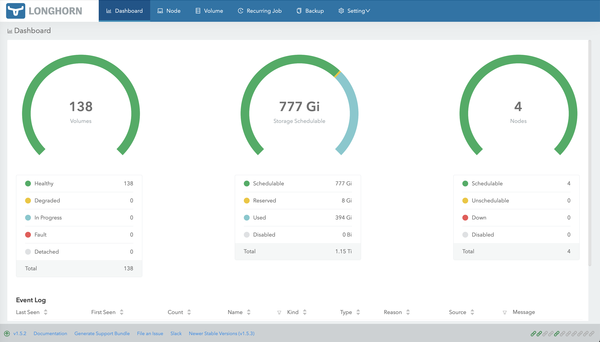
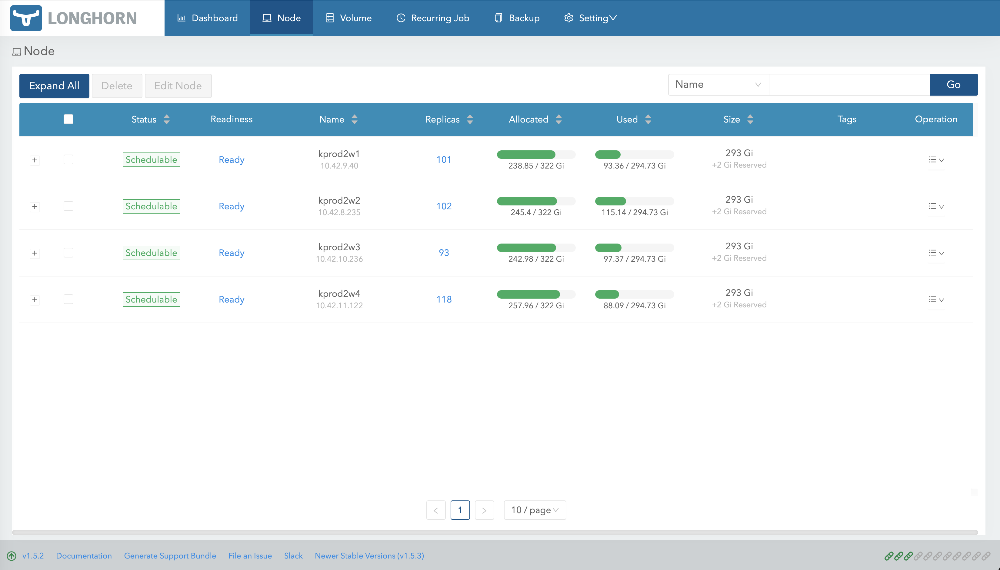
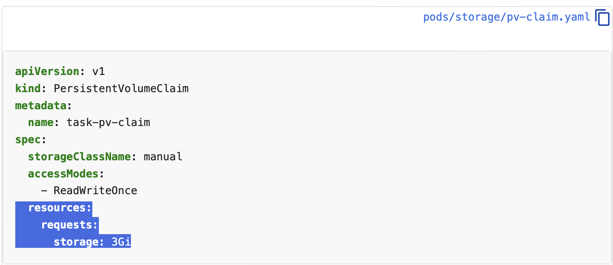

# Longhorn dashboard explained
2024-02-08 - Viorel Anghel @ esolutions.tech

## What is Longhorn
We are using [Longhorn](https://longhorn.io) in many on-premise Kubernetes clusters as the default block storage system. Basically, is that part which allows you to have a _storage class_ and create _PersistentVolumeClaims_ / _PersistentVolumes_ in Kubernetes.

Longhorn has many advantages: 
- it's free and opensource and now it is even a [Cloud Native Computing Foundation](https://www.cncf.io) project
- it's a distributed system, volumes are replicated on 3 (by default) nodes
- it can be upgraded without disrupting the persistent volumes 
- it has good backup options

And also, it has a web dashboard, the topic I will discuss here. I will assume you already know how to access it if you use Longhorn.

## Longhorn dashboard

This is a screenshot from one of our clusters:

It looks like we are in great shape, the circle in the middle shows we have more than half of the disk space _schedulable_, less than half used.

But the story is not complete, click on the _Node_ tab and you see:

In the column _Allocated_ you see about 75% is used on every node. In the column _Used_, about 30-40% used on every node. **Um, what? I'm confused, do we have enough storage or not?**

## Longhorn dashboard explained

The [dashboard is explained in the official documentation](https://longhorn.io/docs/1.6.0/nodes-and-volumes/nodes/node-space-usage/), but who has time for that...

So, let me present a short version here.

The first dashboard page is useful as a general view and more oriented on the health of the system. Do not trust the green middle circle with _storage schedulable_.

Consult the _Node_ page for disk space, read columns from right to left:

Column _Size_ - that is exactly what storage you have on the node (total disk space of the node minus reserved space). For details, click on the three lines menu on each node to _Edit node and disks_.

Column _Used_ X/Y - X is exactly how much storage is used inside volumes. For example, you may create a 10GB PVC/PV and store only 1GB files inside it. Second number in this column is total space on the node (reserved space included).

Column _Allocated_ Z/T - Z is the sum of sum allocated disk space by volumes, the _storage:_ part in PVC definition:

The second number in _Allocated_ is the _max size for volume scheduling_, or _Size_ multiplied with _Storage Over Provisioning Percentage_. 

Yeees, Longhorn can do over-provisioning. And this is exactly for the situation when you create big PVC/PV but use little disk space inside them. 

## All the numbers explained

So, let's see again the last screenshot and decipher all the numbers:

- column _Size_ - 293GB available on each node
- column _Used_ (first node) - 93 GB really used from 294 GB total (the above size plus reserved)
- column _Allocated_ (first node) - 238GB allocated in PVC/PV, 322 available for allocation. this 322 is 293 (size available) * 110% (we have 110 over provisioning percentage).

So, in conclusion, we are at about 75% usage, not under 50% as you may be mislead by the first screeshot. Not great, not terrible!

That's all, HTH.

